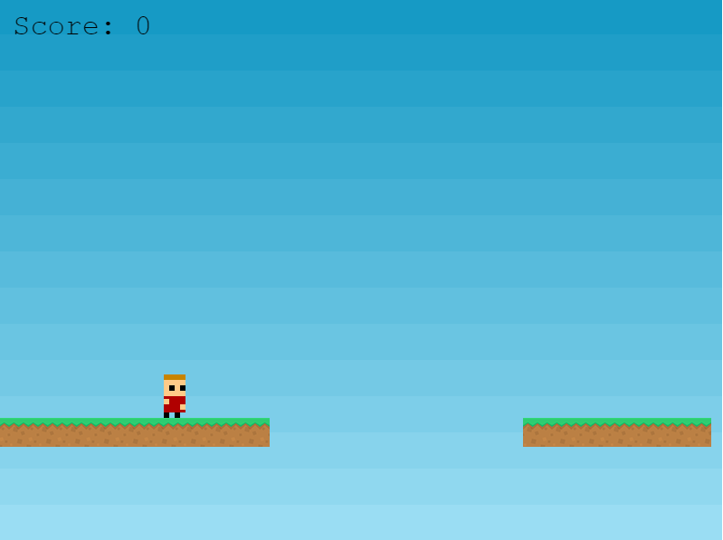

# Brave-Runner
This is an HTML5 game built with modern javascript and phaser 3



## Live Link

- Live: [DEMO](https://rawcdn.githack.com/MahmoudBakr23/Brave-Runner/b772b2d72dac5b23e34b1b810d8dbdf8b2655b25/dist/index.html)

## Built with

- Pure JavaScript
- Jest
- DOM properties and attributes
- Phaser 3
- Leaderboard API

## Getting Started
To get a local copy of the repository please run the following commands on your terminal:
- ```$ cd <folder>```
- ```$ git clone https://github.com/MahmoudBakr23/Todo-List.git ```
- ```$ cd Brave-Runner ```
- ``` npm install ```
- ``` npm run build ```
- ``` npm run start ```
- open your browser on ``` http://localhost:5500/ ```

To run the tests:
- ```npm install --save-dev @babel/preset-env```
- ```npm run test```

## Authors

👤 **Mahmoud Bakr**
- Github: [@MahmoudBakr23](https://github.com/MahmoudBakr23)

- Linkedin: [Mahmoud Bakr](https://www.linkedin.com/in/m-bakr/)

- Email: [contact on Gmail](mbakr6821@gmail.com)

##    Contributing

Contributions, issues and feature requests are welcome!

## Show your support

Give a ⭐️ if you like this project!

## Acknowledgement

- Zenva
- Microverse